# EventID: 115 - SOC165 - Possible SQL Injection Payload Detected

## 🕵️ Incident Summary
> On February 25, 2022, EventID 115 triggered an alert for a potential SQL Injection attempt on internal web server WebServer1001 (IP: 172.16.17.18). The suspicious HTTP GET request contained the payload " OR 1=1 --, a common SQL Injection pattern. The request originated from an external IP (167.99.169.17) and was logged with a 500 Internal Server Error response, indicating server-side processing issues. Upon investigation, the alert was confirmed as a True Positive; the malicious request was detected but did not compromise the server. The affected host was contained, and relevant indicators of compromise (IOCs) were documented for future reference.

---

## 📑 Alert Details

| Field                  | Value                                                                 |
|------------------------|-----------------------------------------------------------------------|
| **Event ID**           | 115                                                                   |
| **Rule**               | SOC165 - Possible SQL Injection Payload Detected                      |
| **Level**              | Security Analyst                                                      |
| **Event Time**         | Feb 25, 2022 — 11:34 AM                                              |
| **Hostname**           | WebServer1001                                                         |
| **Destination IP**     | 172.16.17.18                                                          |
| **Source IP**          | 167.99.169.17                                                         |
| **HTTP Request Method**| GET                                                                   |
| **Requested URL**      | https://172.16.17.18/search/?q=%22%20OR%201%20%3D%201%20--%20-        |
| **User-Agent**         | Mozilla/5.0 (Windows NT 6.1; WOW64; rv:40.0) Gecko/20100101 Firefox/40.1 |
| **Alert Trigger Reason** | Requested URL contains OR 1 = 1                                     |
| **Device Action**      | Allowed                                                                |
| **Case Created**       | Aug 17, 2025 — 11:33 PM                                              |
| **Incident Type**      | Web Attack                                                            |

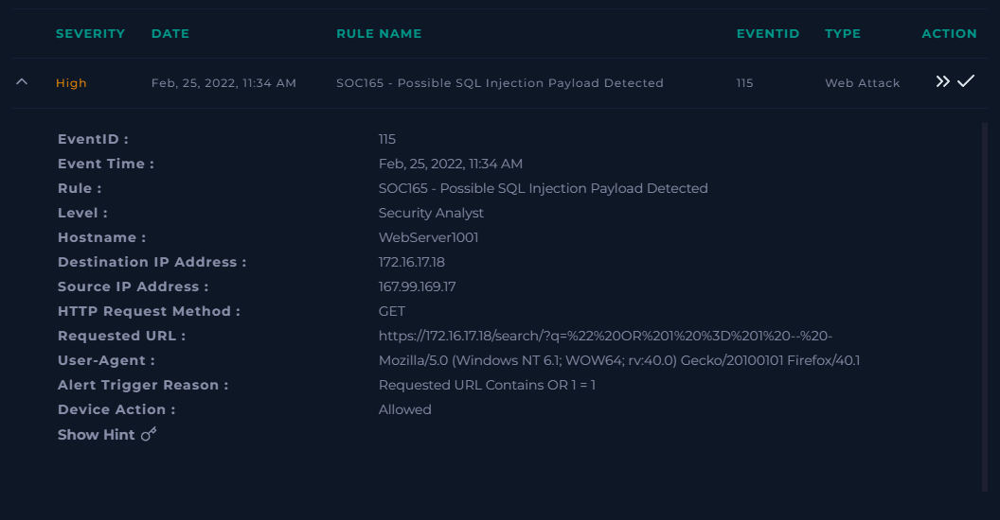

---

## ⚙️ Background

### What is SQL?
Structured Query Language (SQL) is used to communicate with relational databases. It allows users to query, insert, update, and manage data.

### What is SQL Injection (SQLi)?
SQL Injection is a type of attack where malicious actors manipulate input fields or URL parameters to execute unintended SQL commands on a database.  
Common impacts include:
- Bypassing authentication  
- Extracting sensitive data  
- Modifying or deleting database entries  
- Gaining administrative privileges  

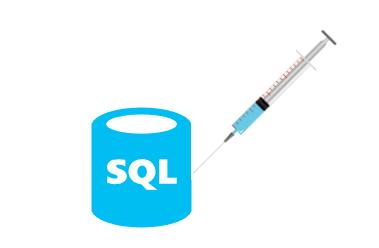

---

## 🔍 Investigation Steps

### 1️⃣ Take Ownership & Create Case
**Action:**  
- Created the case for EventID 115 and took ownership to manage the investigation.  

**Importance:**  
- Ensures accountability, proper documentation, and a clear point of contact for the investigation.

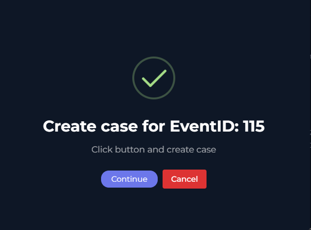

---

### 2️⃣ Utilize the Playbook
**Action:**  
- Reviewed the alert to identify why it was triggered, including rule name analysis (`SOC165 - Possible SQL Injection Payload Detected`) and device traffic direction.  
- Captured source and destination information for context.  

| Playbook                               | Answer                                         |
|---------------------------------------:|-----------------------------------------------|
| **When was it sent?**                  | **Feb 25, 2022 — 11:34 AM**                  |
| **Source IP Address**                   | **167.99.169.17**                             |
| **Destination IP Address**              | **172.16.17.18**                              |
| **Hostname**                            | **WebServer1001**                             |
| **Requested URL**                       | **https://172.16.17.18/search/?q=%22%20OR%201%20%3D%201%20--%20-** |
| **User-Agent**                          | **Mozilla/5.0 (Windows NT 6.1; WOW64; rv:40.0) Gecko/20100101 Firefox/40.1** |
| **Is the traffic suspicious?**         | **Yes**                                       |
| **Device Action**                       | **Allowed**                                   |

**Importance:**  
- Provides a structured starting point for consistent evidence collection and accurate threat classification.

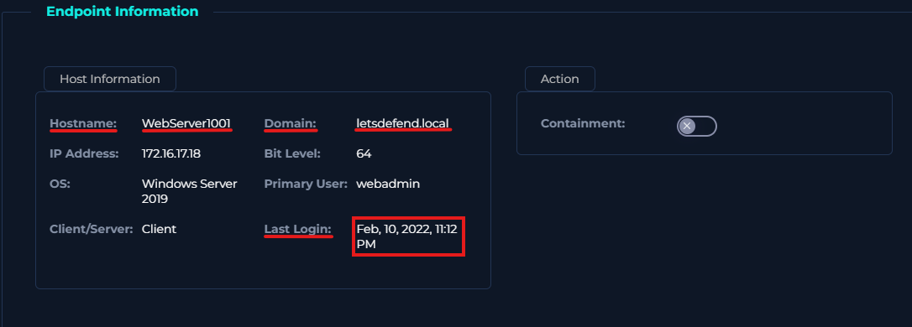

---

### 3️⃣ Detection
**Actions Taken:**  
- Verified HTTP GET request and requested URL contained SQL Injection pattern (`" OR 1=1 --`).  
- Reviewed server response code (500) indicating server-side error.  
- Confirmed traffic was from an external IP to internal web server.  

**Importance:**  
- Confirms that the request was malicious in nature and requires immediate attention.

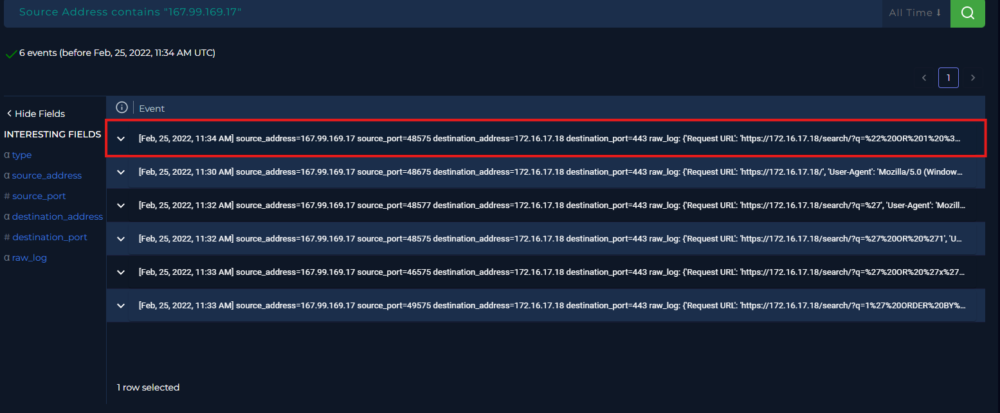

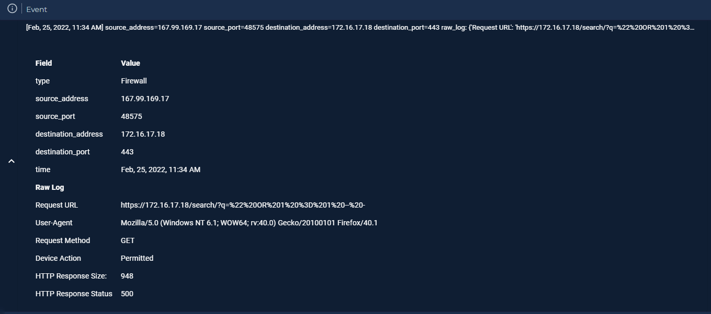

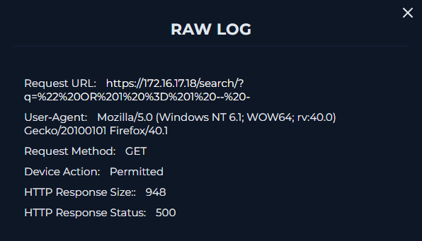

---

### 4️⃣ IP and Device Analysis
**Actions Taken:**  
- Source IP 167.99.169.17 looked up in VirusTotal, AbuseIPDB, and Cisco Talos.  
- Determined IP is owned by DigitalOcean, LLC, static, and reported in threat databases.  
- Destination server 172.16.17.18 hostname is WebServer1001 under `letsdefend.local`.  

**Importance:**  
- Validates external threat origin and ensures contextual understanding of affected assets.

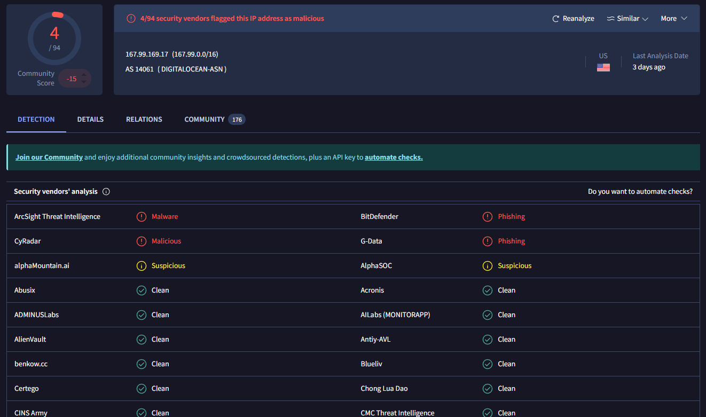

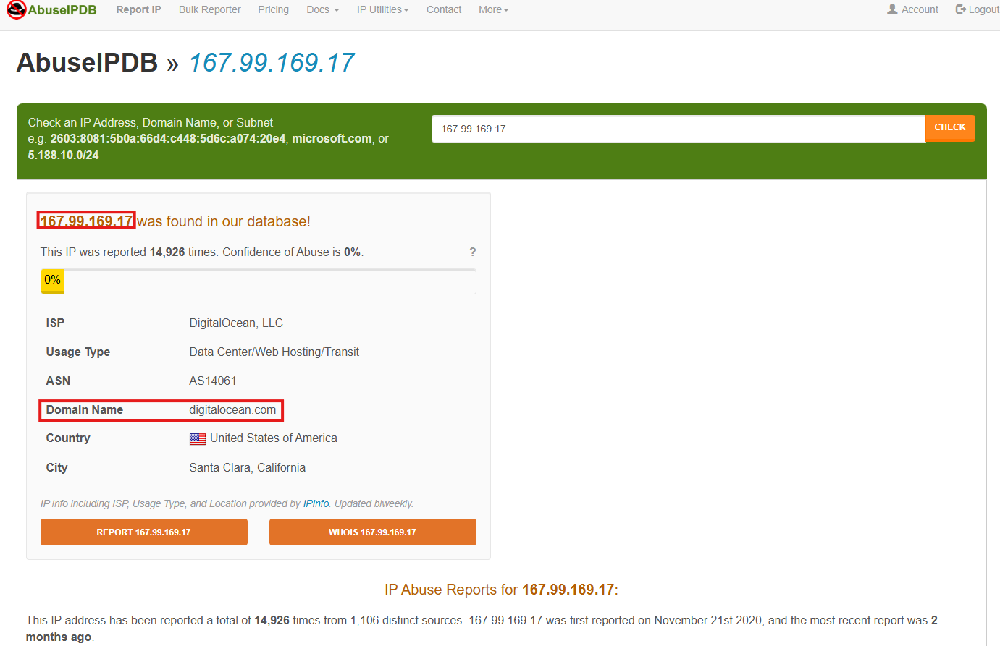

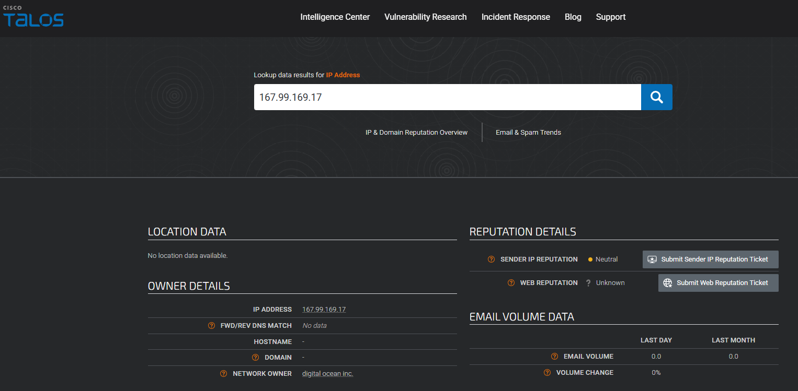

---

### 5️⃣ Payload and HTTP Analysis
**Actions Taken:**  
- Decoded URL: `%22 OR 1=1 --` → `" OR 1=1 --`  
- Confirmed classic SQL Injection attempt.  
- Checked HTTP Response size (948) and status code (500) to determine attack success.  

**Importance:**  
- Analyzing payload and server response allows assessment of attack impact and success.

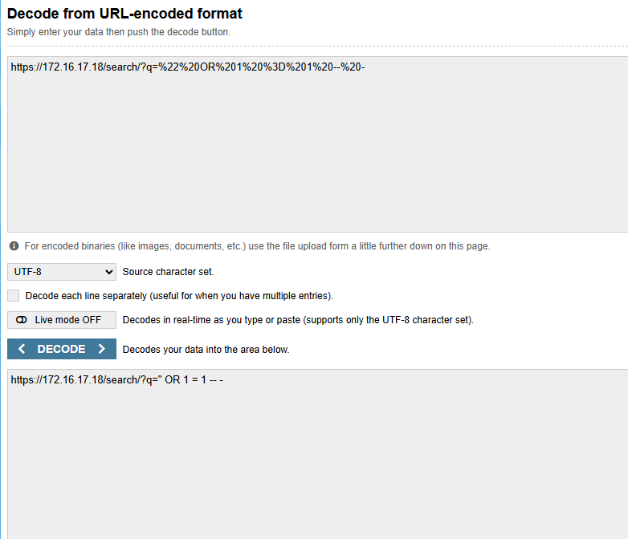

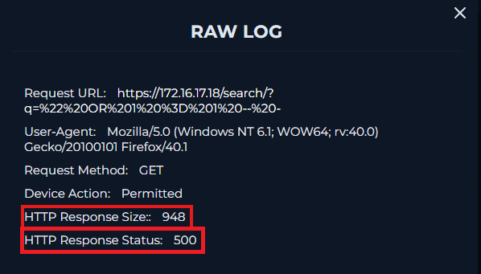

---

### 6️⃣ Containment
**Action:**  
- Contained host WebServer1001 to prevent further exploitation or lateral movement.  

**Importance:**  
- Protects internal network and allows safe forensic investigation.

---

### 7️⃣ Remediation
**Actions Taken:**  
- Added artifacts to case: Source IP, Source Domain, Requested URL, Decoded URL.  
- Recommended patching, input validation, and monitoring for repeated attack attempts.  

**Importance:**  
- Ensures future attacks are mitigated and system integrity restored.

## 🧾 Artifacts / Indicators of Compromise (IOCs)

| Type              | Value                                                                 |
|------------------|-----------------------------------------------------------------------|
| **Source IP**      | 167.99.169.17                                                        |
| **Source Domain**  | digitalocean.com                                                     |
| **Requested URL**  | https://172.16.17.18/search/?q=%22%20OR%201%20%3D%201%20--%20-      |
| **Decoded URL**    | https://172.16.17.18/search/?q=" OR 1=1 --                           |

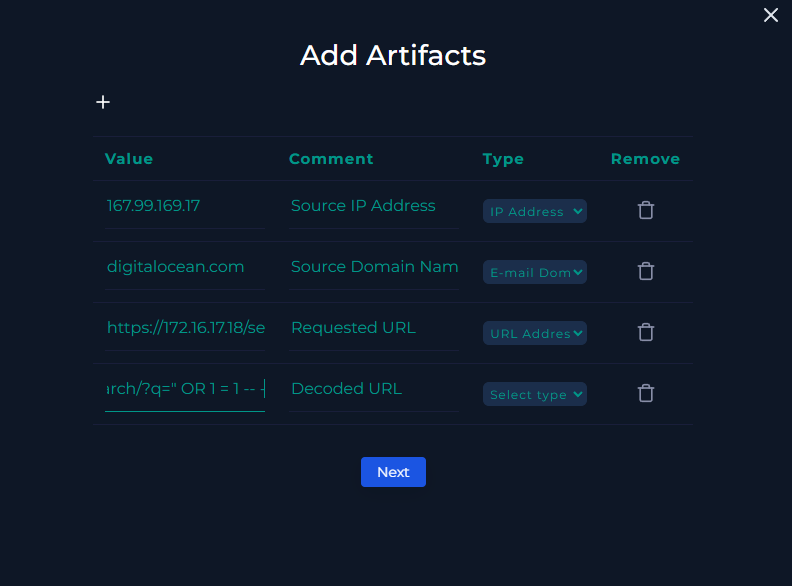

---

### 8️⃣ Closing the Case
**Analyst Note:** 
> Investigation confirmed a suspicious HTTP request attempting SQL Injection (EventID 115). The request originated from an external IP, reached an internal web server, and included the payload `" OR 1=1 --`. The server responded with a 500 error, indicating the attack was not successful. Relevant artifacts including source IP, domain, requested URL, and decoded URL were documented. Case closed as **True Positive**.

**Action:**  
- Closed the case in LetsDefend as True Positive.  

**Importance:**  
- Ensures documentation completeness, supports threat intelligence, and aids future SOC tuning.

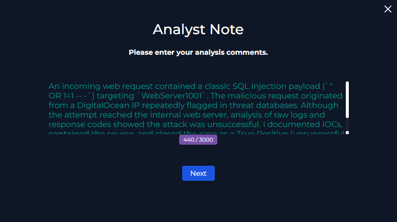

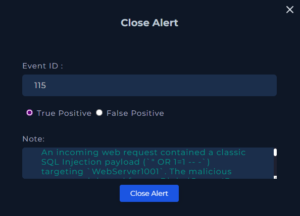

