# 116 - SOC166 - Javascript Code Detected in Requested URL

## Incident Summary
A potential **cross-site scripting (XSS) attack** was detected when JavaScript code was identified in a URL query parameter targeting an internal web server. The attacker, originating from a public IP address in China, attempted multiple variations of XSS payloads against `WebServer1002`. Although the malicious requests reached the server, the payloads were not executed successfully due to HTTP redirection responses (302). This incident has been classified as a **True Positive** but **unsuccessful attack**, and escalation is not required.

---

## Background Information

### What is JavaScript?
JavaScript is a scripting language commonly used in web development to create interactive functionality in browsers. It runs on the client side, meaning attackers can attempt to inject malicious JavaScript into web applications to manipulate behavior, steal data, or bypass security controls.

### What is an XSS Attack?
Cross-Site Scripting (XSS) is a type of web attack where malicious JavaScript is injected into a vulnerable application. There are several types:  
- **Reflected XSS (Non-Persistent)** – This is a non-persistent type of XSS where the XSS payload must be present in the request. It is the most common type of XSS.  
- **Stored XSS (Persistent)** – This type of XSS is where the attacker can permanently upload the XSS payload to the web application. Compared to other types, Stored XSS is the most dangerous type of XSS.  
- **DOM-based XSS** – DOM Based XSS is an XSS attack where the attack payload is executed as a result of modifying the DOM "environment" in the victim's browser used by the original client-side script so that the client-side code runs in an "unexpected" manner. (OWASP)  

In this case, the attack was **Reflected XSS** because the malicious payload was embedded in the URL query string.

---

## Investigation Walkthrough

### Alert Details
Alert Metadata (from Investigation Channel):
| Field                    | Value |
|-------------------------:|-------|
| **EventID**              | 116 |
| **Event Time**           | Feb 26, 2022, 06:56 PM |
| **Rule**                 | SOC166 - Javascript Code Detected in Requested URL |
| **Level**                | Security Analyst |
| **Hostname**             | WebServer1002 |
| **Destination IP**       | 172.16.17.17 |
| **Source IP**            | 112.85.42.13 |
| **HTTP Request Method**  | GET |
| **Requested URL**        | https://172.16.17.17/search/?q=<$script>javascript:$alert(1)<$/script> |
| **User-Agent**           | Mozilla/5.0 (Windows NT 6.1; WOW64; rv:40.0) Gecko/20100101 Firefox/40.1 | 
| **Alert Trigger Reason** | Javascript code detected in URL |
| **Device Action**        | Allowed |

This rule triggered because the system detected JavaScript code embedded in the URL. Alerts must be tied back to the specific detection logic. This prevents analysts from misinterpreting alerts or overlooking why the SIEM flagged the traffic.

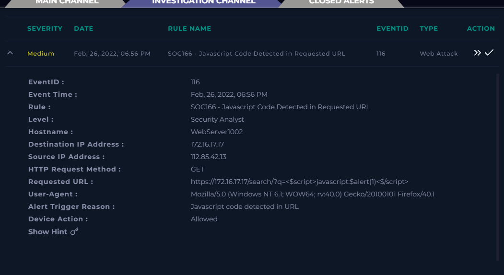

---

### Case Creation
A case was created to track investigation details:  
- **Incident Name:** EventID: 116 - [SOC166 - Javascript Code Detected in Requested URL]  
- **Description:** EventID: 116
- **Incident Type:** Web Attack  
- **Created Date:** Sep 02, 2025, 12:30 AM  

Ensures proper documentation, accountability, and centralized handling of alerts. Without creating a case, evidence may be overlooked or lost.

---

### Determine Traffic Flow
- **Source IP:** 112.85.42.13 (Public, external)  
- **Destination IP:** 172.16.17.17 (Private, internal web server)  
- **Direction:** Internet → Company Network  
- **Protocol:** HTTP (GET request)  

This confirms the malicious activity originated outside the corporate network. Establishing which devices are involved (internal vs external) is crucial for scoping. This step quickly reveals if an attack is originating from the Internet, lateral movement, or insider activity.

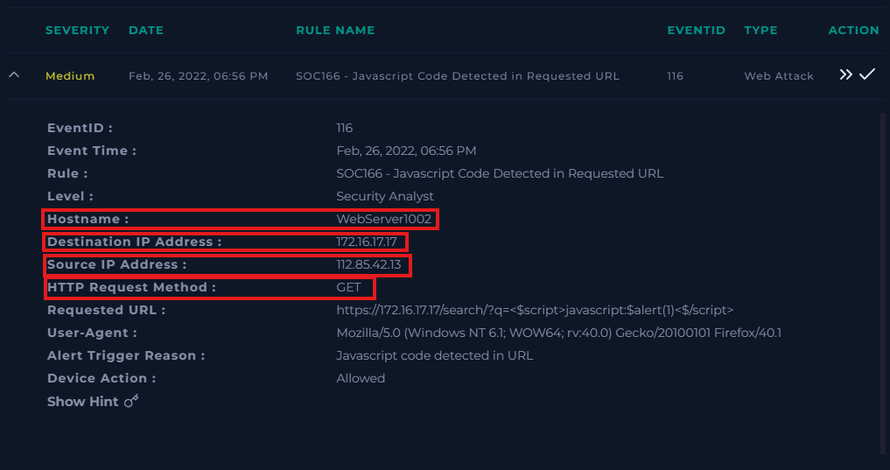

---

### Ownership and Reputation Analysis
- **Destination IP (172.16.17.17)** → Internal server, hostname **WebServer1002**, domain **letsdefend.local**.  
- **Source IP (112.85.42.13)** → Public IP registered to **China Unicom Jiangsu Province Network**.  

**Reputation Lookups:**  
- **AbuseIPDB:** Reported for malicious activity (SSH brute-force attempts).  
- **VirusTotal:** 1/94 vendors flagged it as malicious, community score -13.  
- **Cisco Talos:** Owner confirmed as China Unicom, sender reputation “Poor.”  

This context indicates hostile activity. Identifying whether IPs belong to known cloud providers, ISPs, or enterprise-owned systems allows analysts to separate benign from potentially hostile actors. Reputation lookups also provide external context (e.g., AbuseIPDB, VirusTotal, Cisco Talos).

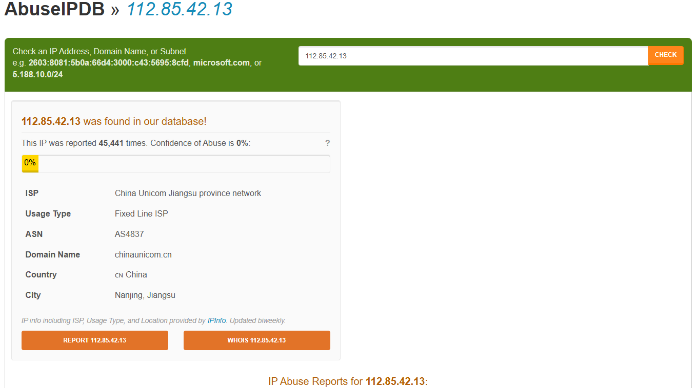

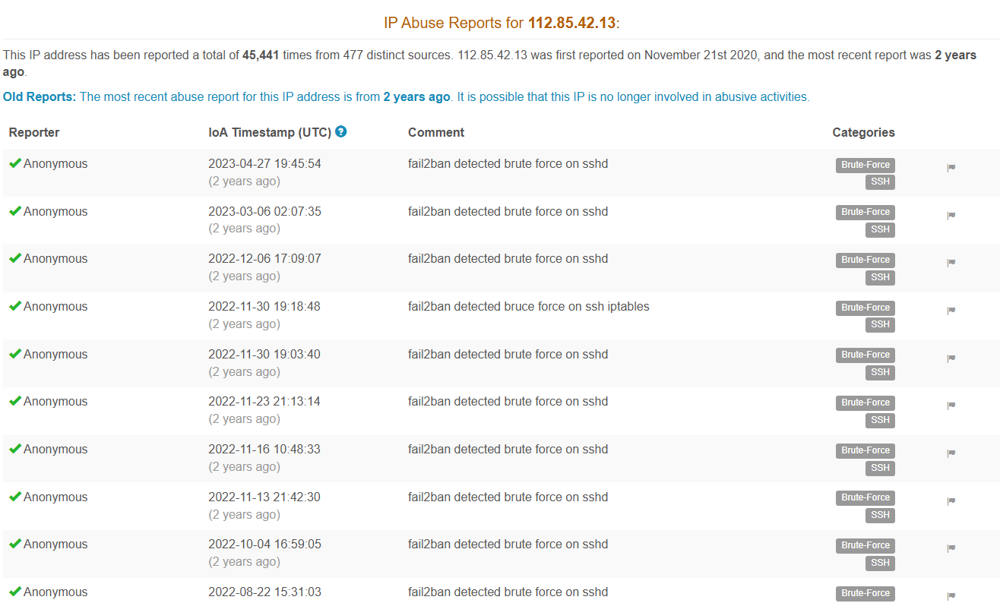

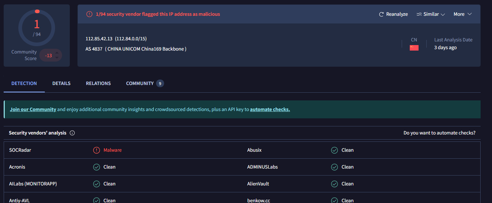

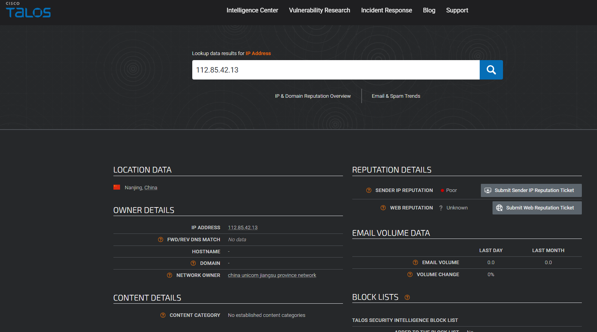
---

### HTTP Log Review
Searching logs for the source IP revealed several XSS payload attempts leading up to the alert:  

| Event # | Requested URL                                                                 |
|---------|-------------------------------------------------------------------------------|
| 1       | `https://172.16.17.17/`                                                       |
| 2       | `https://172.16.17.17/about-us/`                                              |
| 3       | `https://172.16.17.17/search/?q=test`                                         |
| 4       | `https://172.16.17.17/search/?q=prompt(8)`                                    |
| 5       | `https://172.16.17.17/search/?q=<$img src=q onerror=prompt(8)$>`              |
| 6       | `https://172.16.17.17/search/?q=<$svg><$script?>$alert(1)`                    |
| 7       | `https://172.16.17.17/search/?q=<$script>$for((i)in(self))eval(i)(1)<$/script>` |
| 8       | `https://172.16.17.17/search/?q=<$script>javascript:$alert(1)`                |

These show initial benign browsing followed by **progressive XSS payload attempts**. Reviewing logs validates whether the alert is isolated or part of a pattern. This helps confirm intent and distinguish testing from malicious probing.

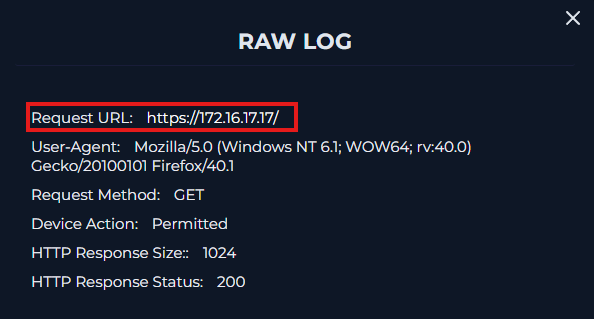

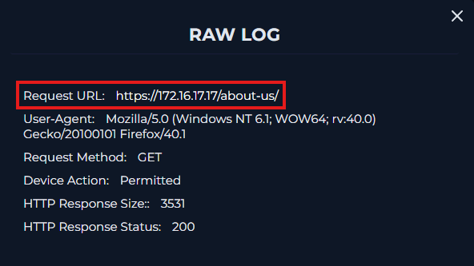

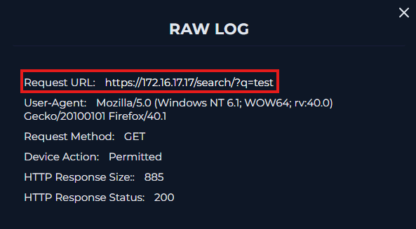

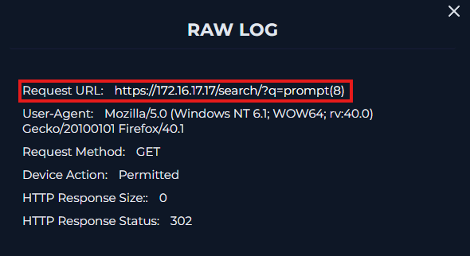

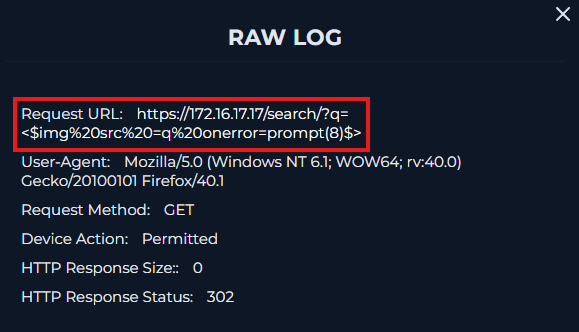

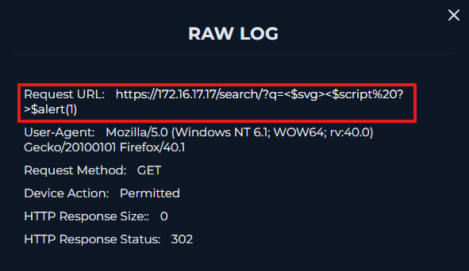

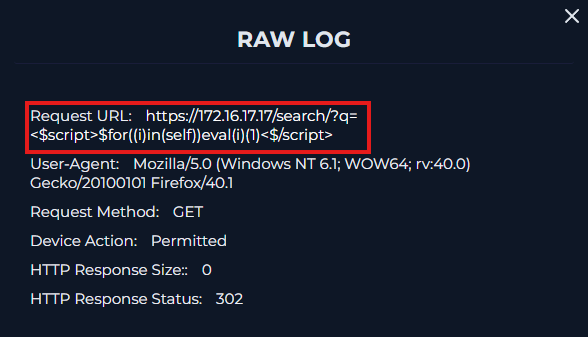

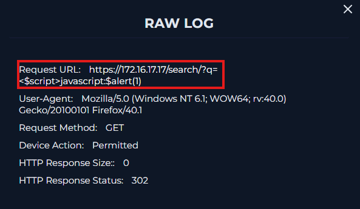

---

### Attack Verification
- The **q parameter** in the URL contained JavaScript payloads.  
- Payload type: **Reflected XSS** (because it was injected in the query string).  
- HTTP responses for malicious requests: **302 Redirection** with response size 0.  
- This indicates the payloads were not successfully executed.  

---

### Planned Test Check
- Email logs searched for: `WebServer1002`, `112.85.42.13`, `172.16.17.17`, keyword “test.”  
- No planned red team activity or test notifications found.  

This confirms it was **not an authorized simulation**. Planned test checks prevent wasted escalation efforts when activity comes from red team exercises or vulnerability scanners authorized by the organization.

---

### Attack Success Check
- **Command History:** No malicious commands observed.  
- **HTTP Responses:**  
- Legitimate requests → 200 OK, normal sizes (1024, 3531, 885).  
- Malicious payloads → 302 redirects, response size 0.  

This confirms the **attack failed**. Checking if the attack was successful determines whether an attempted attack caused harm. This drives whether Tier 2 escalation or containment is necessary.

---

### Artifacts Collected

| Artifact Type     | Value                                                                 |
|-------------------|-----------------------------------------------------------------------|
| Source IP Address | 112.85.42.13                                                          |
| Source Domain     | chinaunicom.cn                                                        |
| Destination Host  | WebServer1002                                                         |
| Destination IP    | 172.16.17.17                                                          |
| Malicious URLs    | Multiple XSS payloads (see Log Review section)                        |
| Attack Type       | Reflected XSS                                                         |

Compiling IPs, domains, and malicious payloads feeds threat intelligence databases and improves detection for future incidents.

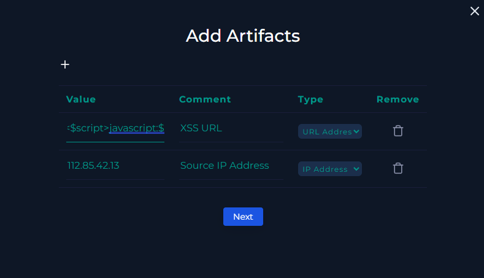

---

## Findings
- The attacker attempted multiple **Reflected XSS payloads**.  
- Source IP was external (China) with a poor reputation.  
- Traffic reached the internal web server but **payload execution was prevented**.  
- Requests with payloads returned HTTP **302 redirects**, indicating unsuccessful exploitation.  
- No evidence of compromise was found.  
- Tier 2 escalation is **not required**.  

---

## Analyst Note
This was a **True Positive alert** for malicious activity. An external IP from China (112.85.42.13) attempted reflected XSS payloads against WebServer1002. The requests were detected, logged, and redirected by the server, resulting in an **unsuccessful attack**. Artifacts have been collected for threat intelligence enrichment. Since the activity did not succeed and no compromise was observed, escalation is not required. The case has been closed.

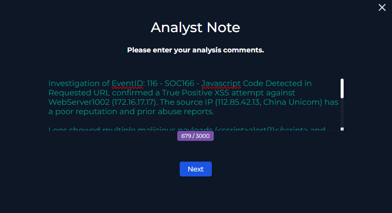
