# 45 - SOC114 - Malicious Attachment Detected - Phishing Alert

## 🕵️ Incident Summary

An alert (EventID **45**) identified a phishing email with a malicious Excel attachment sent from `accounting@cmail.carleton.ca` (SMTP IP `49.234.43.39`) to `richard@letsdefend.io`. The message was delivered, the user opened the attachment, C2 activity was observed, and the host was contained. I created the case, followed the playbook, documented artifacts, and closed the incident as a **True Positive**.

---

## 📑 Alert Details

| Field             | Value |
|------------------:|-------|
| **Event ID**      | 45 |
| **Rule**          | SOC114 - Malicious Attachment Detected - Phishing Alert |
| **Level**         | Security Analyst |
| **Event Time**    | Jan 31, 2021 — 03:48 PM |
| **Device Action** | Allowed |
| **Incident Type** | Exchange |
| **Sender**        | `accounting@cmail.carleton.ca` |
| **Recipient**     | `richard@letsdefend.io` |
| **SMTP IP**       | `49.234.43.39` |
| **Subject**       | `Invoice` |
| **Case Created**  | Aug 11, 2025 — 03:50 AM |

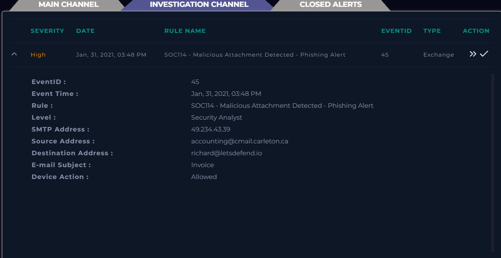

---

## 🔍 Investigation Steps 

### 1️⃣ Take ownership & create case
**Action:** 
- Created the case for EventID 45 and took ownership to manage the investigation.

**Importance:** 
- Ownership ensures a single analyst is accountable for tracking actions, preserving context, and communicating status — reducing the chance the incident is overlooked.

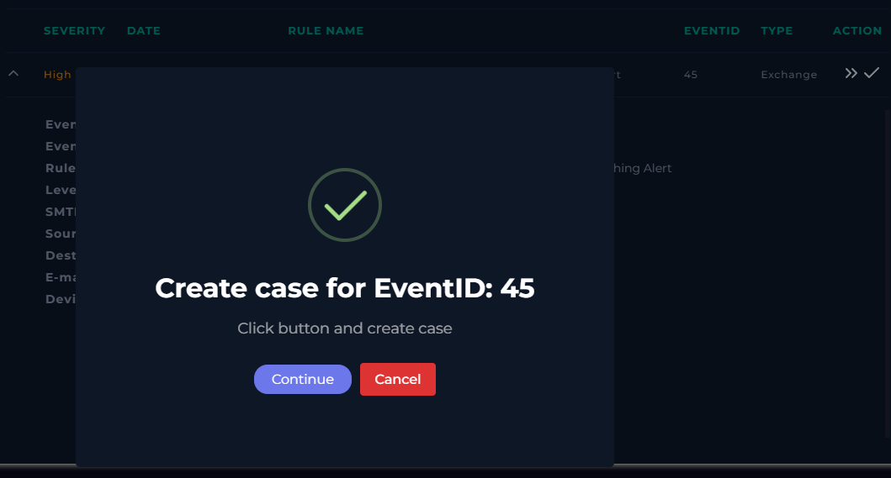

---

### 2️⃣ Utilize the Playbook
**Action:** 
- Parsed the email to capture metadata and answered the initial questions (when sent, SMTP IP, sender, recipient, content, attachments).

**Importance:** 
- Playbooks provide a repeatable checklist so evidence is consistently collected and key decisions are based on documented facts.

| Playbook                              | Answer                           |
|--------------------------------------:|----------------------------------|
| **When was it sent?**                 | **Jan, 31, 2021, 03:48 PM**      |
| **What is the email's SMTP address?** | **49.234.43.39**                 |
| **What is the sender address?**       | **accounting@cmail.carleton.ca** |
| **What is the recipient address?**    | **richard@letsdefend.io**        |
| **Is the mail content suspicious?**   | **Yes**                          |
| **Are there any attachment?**         | **Yes**                          |

---

### 3️⃣ Detection 
**Action:** 
- Verified the Device Action was **Allowed** (email delivered) and reviewed the message content (invoice lure) and presence of an attachment.
- Verified sender, recipient, and SMTP IP from alert details.

**Importance:** 
- Knowing whether a message was delivered and whether it contains common phishing indicators determines the urgency and scope of the response.

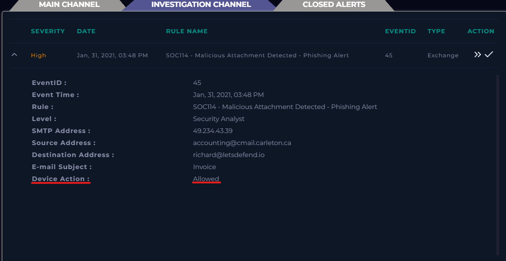

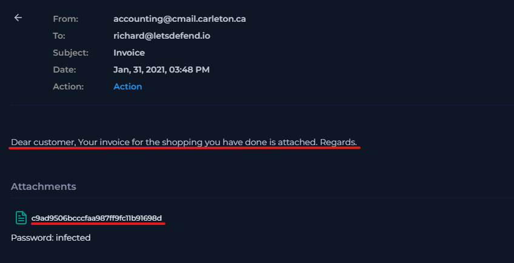

---

### 4️⃣ File & URL Analysis
**Action:** 
- Collected the download link and analyzed the ZIP/XLSX in AnyRun (network Trojan behavior noted).  
- Submitted the XLSX to VirusTotal (37/62 detections; MD5: `c9ad9506bcccfaa987ff9fc11b91698d`).  
- Checked HybridAnalysis (XLSX flagged, high threat score).  
- Looked up SMTP IP in AbuseIPDB (high report count ~2,399; linked to cloud provider).

**CVE Note:**  
- Identified **CVE-2017-11882**, a known Office memory corruption vulnerability exploited by malicious documents to execute arbitrary code. Its presence confirms the malicious nature of the payload.

**Importance:** 
- Correlating results from multiple tools increases confidence that the file is malicious and identifies IOCs for detection and blocking.

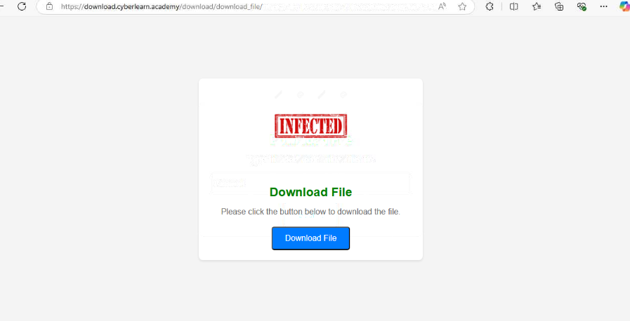

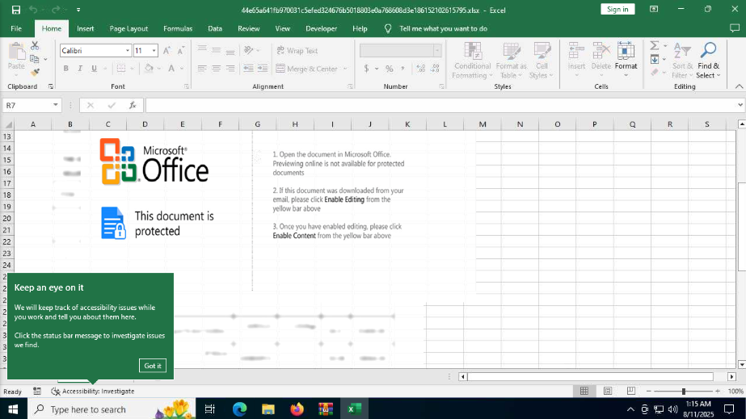

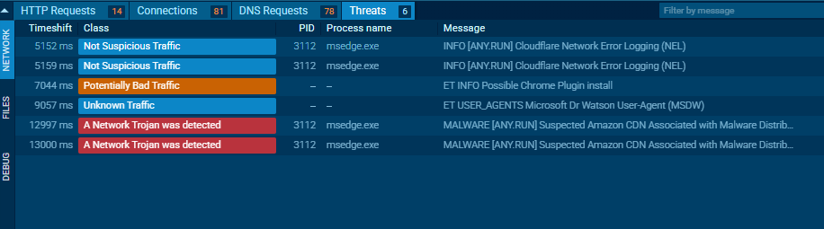

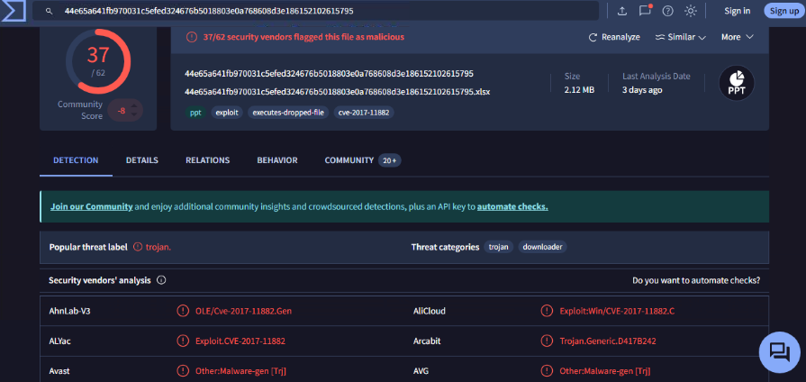

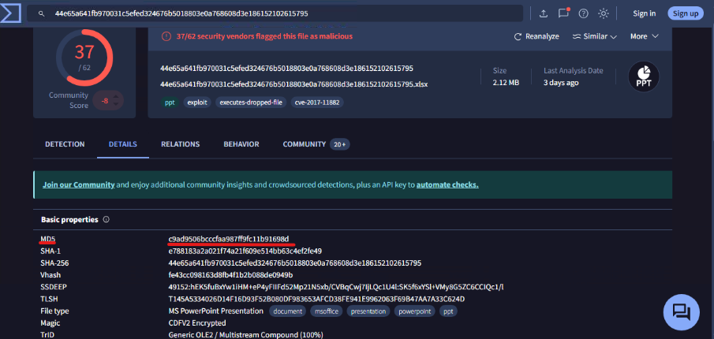

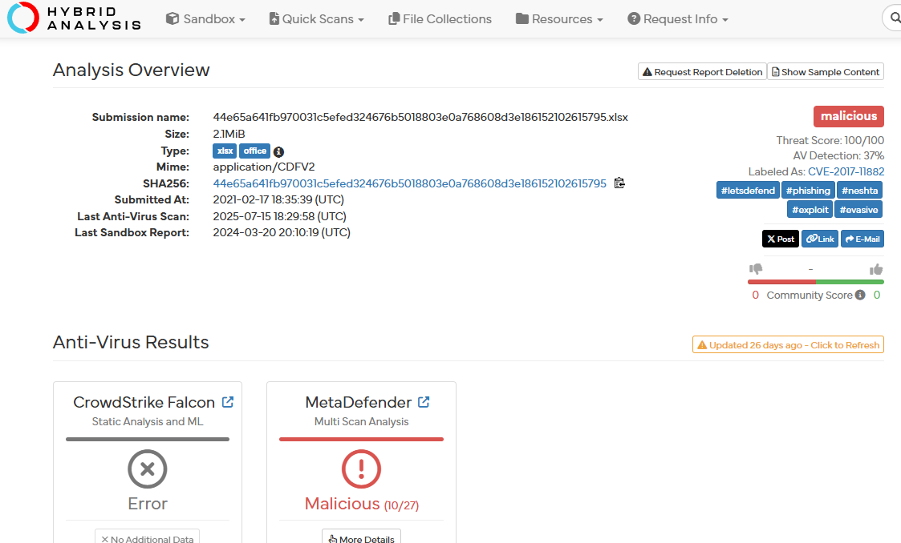

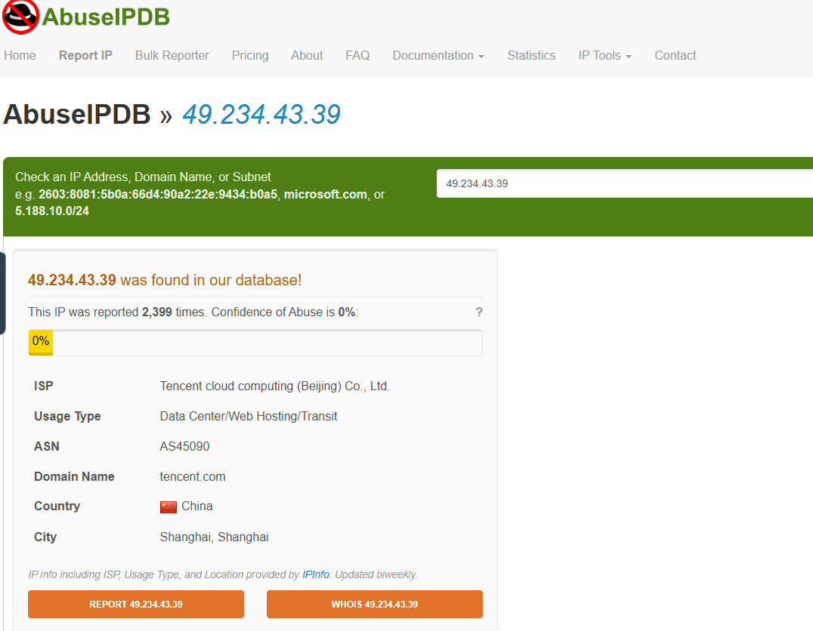

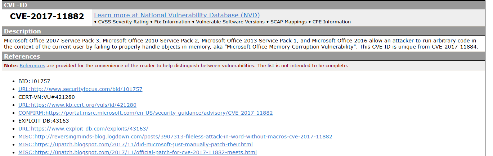

---

### 5️⃣ Delivery & Execution Confirmation
**Action:**  
  - Verified email delivery in Log Management (SMTP/port 25 raw logs).  
  - Confirmed via Endpoint Security that `RichardPRD` opened the malicious file and that subsequent C2 activity occurred. 
  - Matched malicious URL with VirusTotal results.

**Importance:** 
- Confirming execution and C2 proves the attack moved beyond delivery into execution, requiring immediate containment.

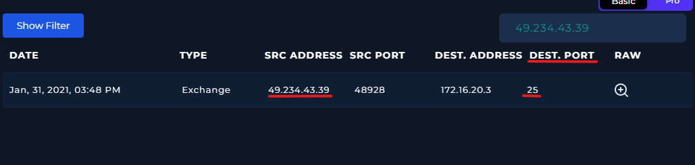

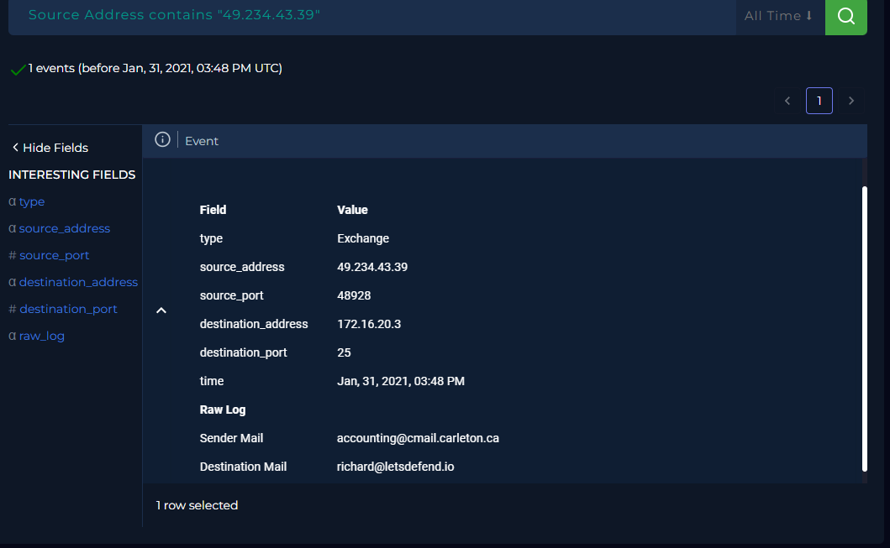

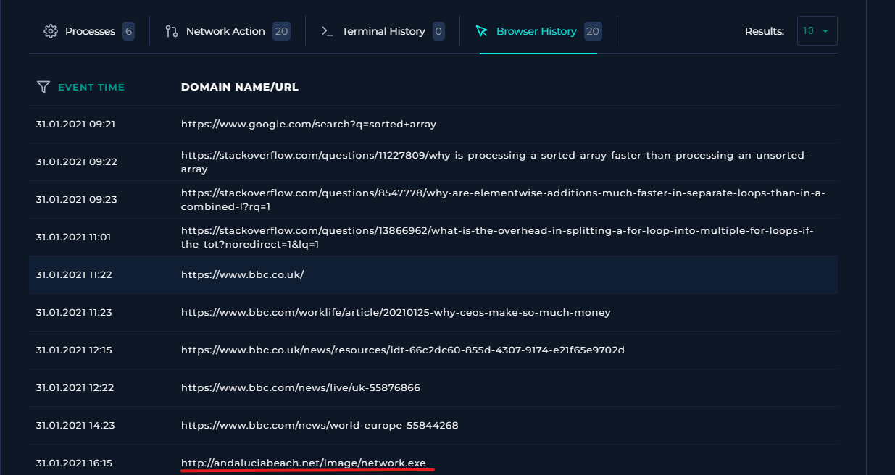

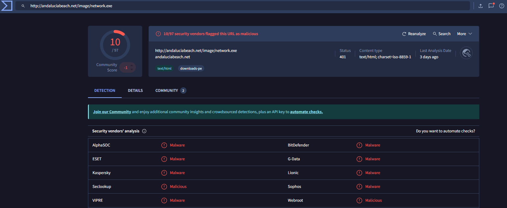

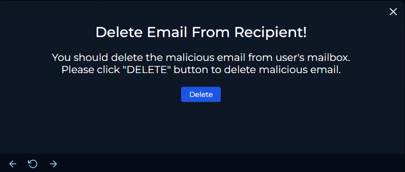

---

### 6️⃣ Containment
**Action:** 
- Contained the affected host via the EDR/Endpoint Security interface.

**Importance:** 
- Containment isolates the compromised system and prevents further lateral movement or data exfiltration while forensic and remediation actions are planned and executed.

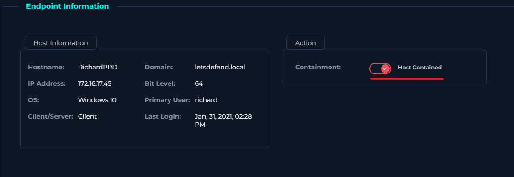

---

### 7️⃣ Remediation Actions
**Action:**  
- Documented all relevant artifacts in the case.  
- Recommended host forensic analysis, mailbox review, and blocking of identified IOCs.

**Importance:**  
- These steps restore system integrity and reduce chances of reinfection, while providing IT teams clear remediation instructions.

---

### 8️⃣ Reporting Artifacts & Documentation
**Action:**  
- Entered key IOCs (hashes, IPs, URLs, sender/recipient) into the case record.  
- Added analyst notes with a clear incident summary.

**Importance:**  
- Proper documentation aids future detection, incident tracking, and knowledge sharing.

## 🧾 Artifacts / Indicators of Compromise (IOCs)

| Type         | Value |
|--------------|-------|
| **MD5**      | `c9ad9506bcccfaa987ff9fc11b91698d` |
| **Filename** | `44e65a641fb970031c5efed324676b5018803e0a768608d3e186152102615795.xlsx` |
| **SMTP IP**  | `49.234.43.39` |
| **Sender**   | `accounting@cmail.carleton.ca` |
| **Email Domain**| `cmail.carleton.ca` |
| **Download URL** | `https://download.cyberlearn.academy/.../c9ad9506bcccfaa987ff9fc11b91698d.zip` |

**Analyst Note:**  
- Investigation confirmed a malicious XLSX delivered by phishing (EventID 45). The recipient opened the attachment, which resulted in observable C2 activity. The host was contained via EDR and relevant IOCs (MD5, SMTP IP, filename, sender/recipient, observed URL) were recorded in the case. Case closed as **True-Positive**.

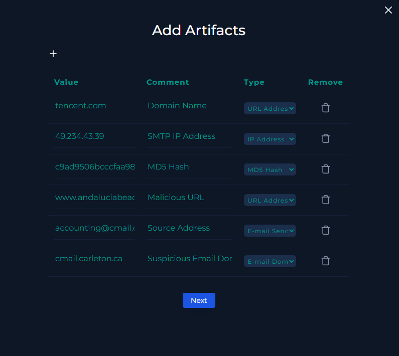

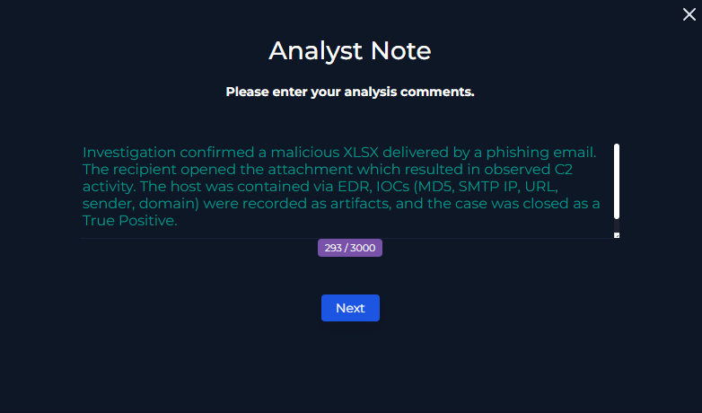

---

### 9️⃣ Closing the Ticket
**Action:** 
- Closed the case as a True Positive.

**Importance:**  
- Closing the case with clear documentation ensures the investigation is complete, searchable, and useful for future SOC tuning.

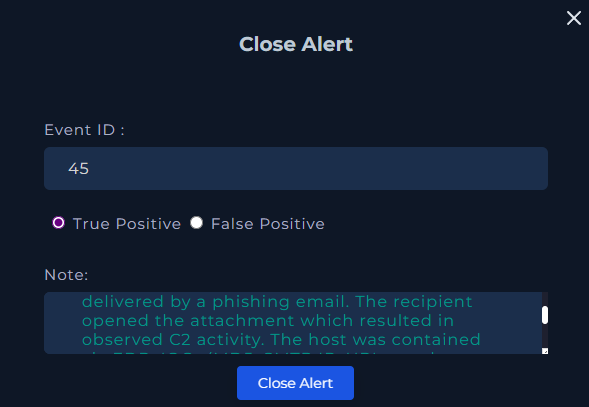

