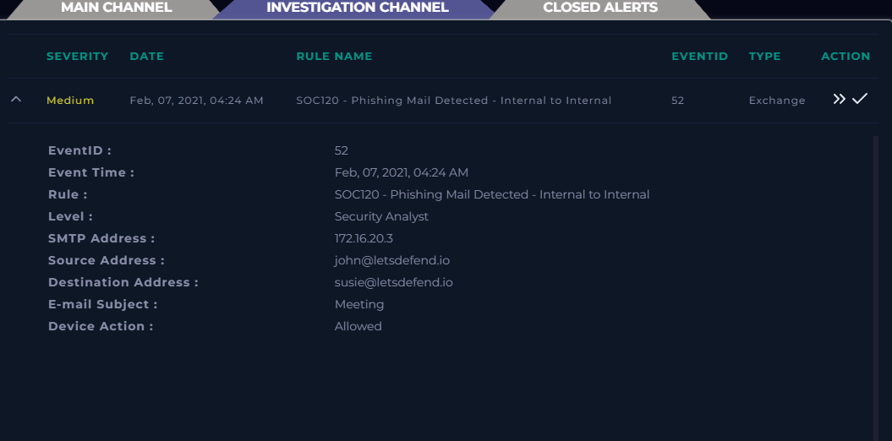
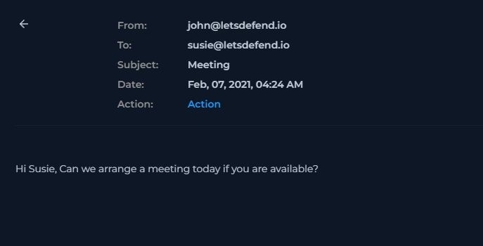
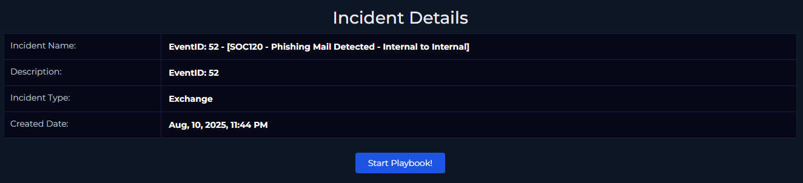
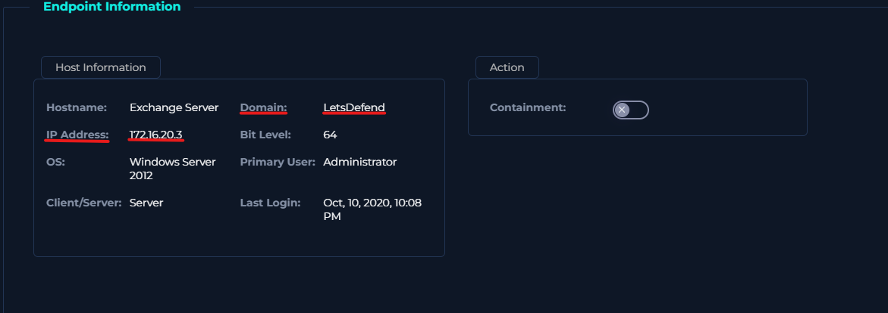
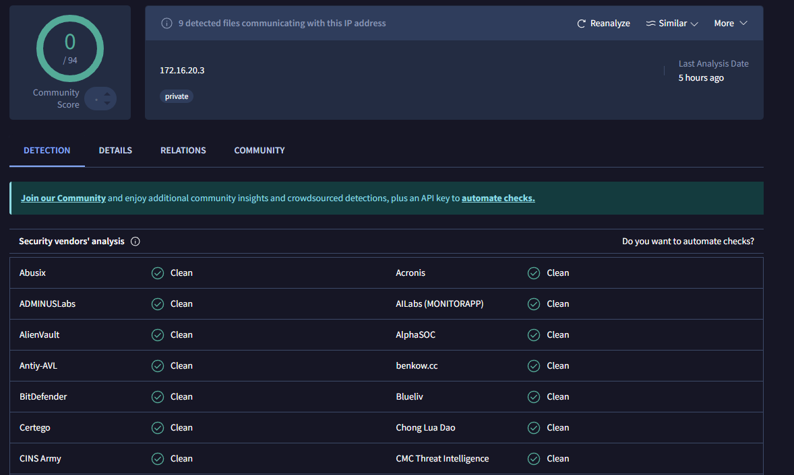
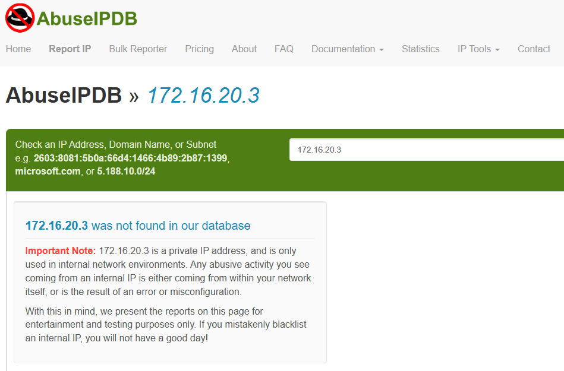
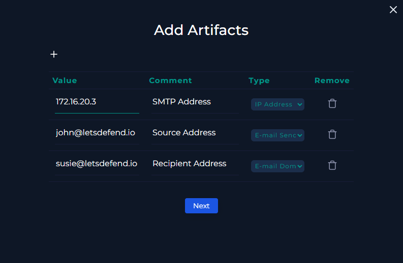
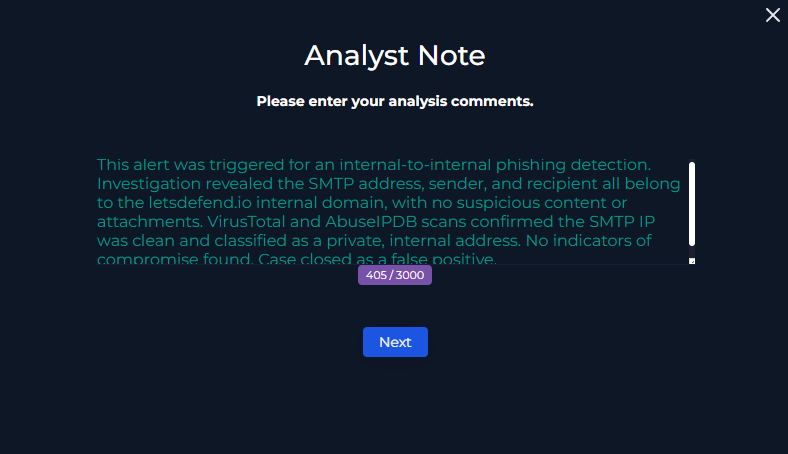
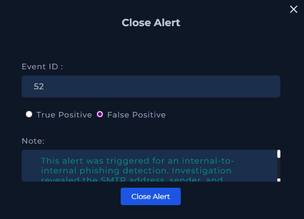

# Event ID: 52 – SOC120 – Phishing Mail Detected – Internal to Internal

## Alert Summary  
This alert was generated for a detected phishing email sent from an internal source to another internal recipient.  
**Event Details:**  
- **EventID:** 52  
- **Event Time:** Feb 07, 2021, 04:24 AM  
- **Rule:** SOC120 – Phishing Mail Detected – Internal to Internal  
- **Level:** Security Analyst  
- **SMTP Address:** 172.16.20.3  
- **Source Address:** john@letsdefend.io  
- **Destination Address:** susie@letsdefend.io  
- **E-mail Subject:** Meeting  
- **Device Action:** Allowed  

---

## Step 1 – Taking Ownership & Creating a Case  
**Action:** Created a case for EventID: 52.  
**Incident Details:**  
- **Incident Name:** EventID: 52 – [SOC120 – Phishing Mail Detected – Internal to Internal]  
- **Description:** EventID: 52  
- **Incident Type:** Exchange  
- **Created Date:** Aug 10, 2025, 10:34 PM  

**Importance:**  
Taking ownership and creating a case ensures proper tracking and documentation of the incident, allowing for organized workflow, accountability, and the ability to review actions later if needed.

---

## Step 2 – Utilizing the Playbook  
**Action:** Followed the phishing investigation playbook to ensure all required checks were performed.  
**Importance:**  
Using a playbook provides a consistent, repeatable, and thorough investigation process, reducing the risk of missing critical details.

---

## Step 3 – Detection  
**Action:** Gathered initial information from alert details:  
- **Sent:** Feb 07, 2021, 04:24 AM  
- **SMTP Address:** 172.16.20.3  
- **Sender:** john@letsdefend.io  
- **Recipient:** susie@letsdefend.io  
- **Content Suspicious?:** No – internal domain sender and recipient.  
- **Attachments?:** None.  

**Importance:**  
Detection steps confirm whether the alert contains any obvious indicators of compromise, helping to quickly determine potential severity.

---

## Step 4 – Analysis  
**Actions Taken:**  
1. **Checked SMTP Address in Endpoint Security:** Confirmed it belonged to the letsdefend.io domain (Exchange Server hostname).  
2. **VirusTotal Scan:** No malicious results found.  
3. **AbuseIPDB Check:** Address not in database; identified as a private IP used for internal networks.  

**Importance:**  
Thorough analysis ensures the case is fact-driven and reduces the chance of false positives being escalated unnecessarily.

---

## Step 5 – Containment  
**Action:** None required – no malicious indicators detected.  
**Importance:**  
Containment actions prevent the spread of a threat. Even in false positives, noting this step confirms containment was considered.

---

## Step 6 – Remediation Actions  
**Action:** None required – confirmed false positive.  
**Importance:**  
Remediation removes the root cause of the issue. In this case, no threat existed to remediate.

---

## Step 7 – Reporting Artifacts  
**Artifacts Added:**  
- SMTP Address  
- Source Address  
- Recipient Address  

**Importance:**  
Documenting artifacts creates a reference for future incidents, allowing for faster detection and recognition of recurring patterns.

---

## Step 8 – Closing the Ticket  
## Analyst Note  
This alert was triggered for an internal-to-internal phishing detection. Investigation revealed the SMTP address, sender, and recipient all belong to the letsdefend.io internal domain, with no suspicious content or attachments. VirusTotal and AbuseIPDB scans confirmed the SMTP IP was clean and classified as a private, internal address. No indicators of compromise found. Case closed as a false positive.

**Action:** Closed the case as a False Positive.  
**Importance:**  
Proper closure ensures that the case is documented, categorized, and searchable for future reference. This also improves alert tuning and detection accuracy over time.

---

## Why This Investigation Was Important  
Even though this case was a false positive, performing the full investigation:  
- Confirms alert accuracy and system tuning.  
- Helps identify internal email patterns to prevent future misclassification.  
- Maintains incident response discipline so no potential threat is overlooked.  
