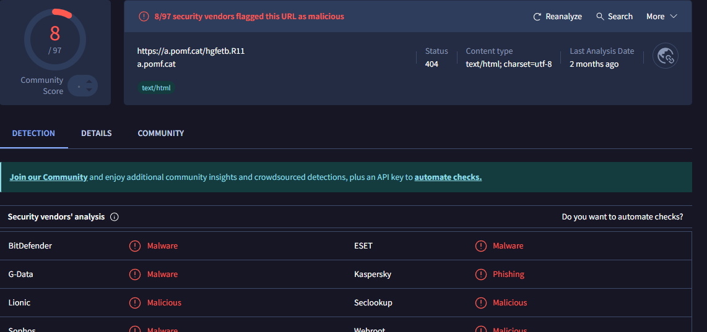

# 82 - SOC140 - Phishing Mail Detected - Suspicious Task Scheduler

## 🕵️ Incident Summary

An alert (EventID: **82**) was triggered for **SOC140 - Phishing Mail Detected - Suspicious Task Scheduler**. The alert indicated a phishing email with an attachment that attempted to contact an external URL. I created a case for EventID 82 and ran the playbook to analyze the email, the attachment, and any associated indicators.

---

## 📑 Alert Details

| Field                   | Value                                                                 |
|------------------------:|-----------------------------------------------------------------------|
| **Event ID**            | 82                                                                    |
| **Rule**                | SOC140 - Phishing Mail Detected - Suspicious Task Scheduler           |
| **Level**               | Security Analyst                                                      |
| **Event Time**          | Mar 21, 2021 — 12:26 PM                                               |
| **Created Date**        | Aug 09, 2025 — 10:17 PM                                               |
| **SMTP (IP)**           | `189.162.189.159`                                                     |
| **Sender Email**        | `aaronluo@cmail.carleton.ca`                                          |
| **Recipient Email**     | `mark@letsdefend.io`                                                  |
| **Subject**             | `COVID19 Vaccine`                                                     |
| **Device Action**       | Blocked                                                               |

---

## 🔎 Investigation Steps & Notes

1. **Parse the email (Playbook start)**  
   - Collected metadata: EventID, Event Time, SMTP IP, sender, recipient, subject, and Device Action.  
   *Analyst note:* The Device Action was **Blocked**, so the message was not delivered to the recipient.

2. **Confirm answers to parsing questions**  
   - When was it sent? — **Mar 21, 2021, 12:26 PM**  
   - What is the email's SMTP address? — **189.162.189.159**  
   - What is the sender address? — **aaronluo@cmail.carleton.ca**  
   - What is the recipient address? — **mark@letsdefend.io**  
   - Is the mail content suspicious? — **Yes** (pressing urgency: "Open it now!")  
   - Are there any attachments? — **Yes**

   

3. **Analyze the attachment in a sandbox environment (AnyRun)**  
   - Downloaded the attached ZIP (protected by password), extracted `Material.pdf`.  
   - Opening the PDF produced a security prompt indicating a connection to `https://a.pomf.cat/hgfetb.R11`. The sandbox interaction reached the URL and ultimately returned a 404 page.  
   *Analyst note:* The PDF attempted network activity to an external URL — this behavior is suspicious for a document-delivered payload.

   

   

4. **Submit the PDF to VirusTotal**  
   - PDF `Material.pdf` scan result: **26/63** detections.  
   - MD5 hash recorded: **`72c812cf21909a48eb9cceb9e04b856d`**.  
   *Analyst note:* Multiple AV engines flagged the PDF as malicious/Trojan — this strengthens the case that the attachment is malicious.

   

   

5. **Check the presented URL in VirusTotal**  
   - `https://a.pomf.cat/hgfetb.R11` — VirusTotal flagged it as malicious (**8/97**).  

   

6. **Analyze with HybridAnalysis**  
   - Submitting the PDF to HybridAnalysis returned a **100/100** threat score for the attachment.  
   - The associated URL also showed a **100/100** threat score in HybridAnalysis.  
   *Analyst note:* HybridAnalysis results corroborate the PDF and URL as malicious.

   

   

7. **Scan the URL with URLScan**  
   - URLScan results shows that this website contacted 1 IP `69.39.225.3` which belongs to `ASN-GIGNET, US` and the domain is `a.pomf.cat`.  
 
   

8. **Reputation check for SMTP IP (AbuseIPDB)**  
   - SMTP IP `189.162.189.159` was found in AbuseIPDB with **206 reports**.  
   *Analyst note:* High report counts for the SMTP IP increase confidence that the sending infrastructure is abusive.

    

9. **Delivery check & containment decisions**  
   - Confirmed Device Action: **Blocked** — the email was not delivered.  
   - Added artifacts to the case and marked the playbook decision as **malicious** for the attachment/URL.  
   - Closed the case as a **True Positive** after documenting findings.

   

   
---

## 🧾 Artifacts & Indicators of Compromise (IOCs)

- **Malicious attachment (file):** `Material.pdf`  
  - **MD5:** `72c812cf21909a48eb9cceb9e04b856d`  
  - **VirusTotal (PDF):** 26/63 detections
  - **HybridAnalysis (PDF):** Threat score 100/100

- **Malicious URL:** `https://a.pomf.cat/hgfetb.R11`  
  - **VirusTotal (URL):** 8/97 flagged as malicious  
  - **HybridAnalysis (URL):** Threat score 100/100

- **SMTP IP (sending host):** `189.162.189.159`  
  - **AbuseIPDB:** 206 reports

- **Sender Email:** `aaronluo@cmail.carleton.ca`

---

## 📝 Analyst Note (Case Summary)

Event ID 82 (SOC140) involved a phishing email titled **"COVID19 Vaccine"** containing an attached PDF (`Material.pdf`) that attempted to contact an external URL (`https://a.pomf.cat/hgfetb.R11`). Sandbox behavior showed the document attempting network activity; VirusTotal identified the PDF as a Trojan (26/63), HybridAnalysis returned a 100/100 threat score for the PDF and associated URL, and AbuseIPDB indicated the SMTP IP had 206 prior reports. The Device Action logs showed the message was **blocked** and not delivered. Key IOCs (MD5 hash, SMTP IP, URL, sender) were added to the case. Based on the combined evidence, the alert was classified as a **True Positive** and the case was closed.

---

## ✅ Verdict

- **Classification:** True Positive  
- **Actions recorded:** IOCs documented and added to the case; case closed.

---

## ❗ Why This Is Important

- The attachment exhibited network behavior (attempt to fetch a remote resource) consistent with document-based malware delivery.  
- Multiple independent scanners and sandbox results confirmed malicious behavior, increasing confidence in the detection.  
- Although the Device Action blocked the email and prevented delivery, documenting IOCs (hashes, URLs, SMTP IP) is critical so other systems and teams can proactively block related threats and search for any further activity.  
- Recording and closing the case with clear artifacts helps strengthen future detection and improves the SOC’s threat intelligence.

---