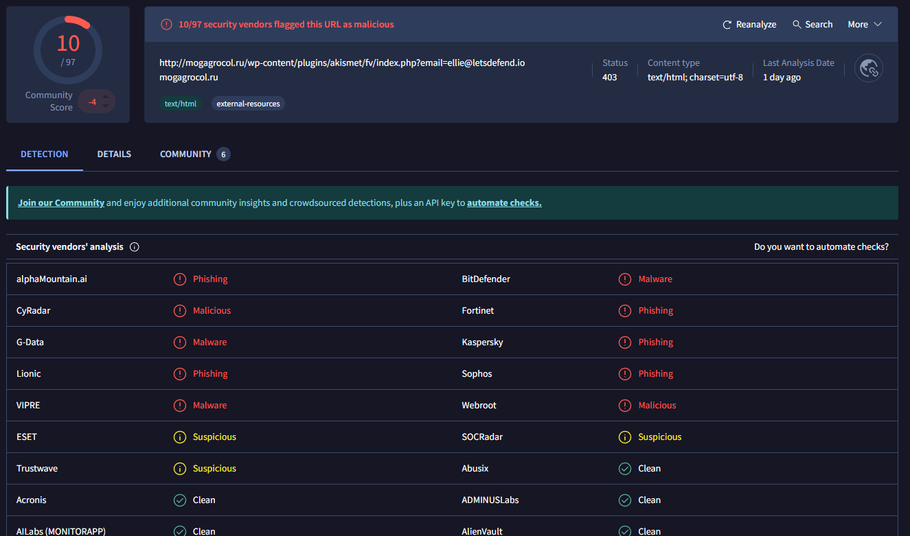

# 86 - SOC141 - Phishing URL Detected

## 🕵️‍♂️ Incident Summary

An alert was triggered for a suspicious phishing URL detected on the network. The investigation began in the Investigation Channel, where I reviewed key details including the Event ID (86), event time, source and destination IP addresses, and user agent information.

The alert indicated possible malicious network activity originating from a device on the internal network attempting to reach an external suspicious URL.

The investigation focused on confirming the URL’s threat status, checking for user/device interactions, and containing the affected endpoint.

---

## 🔍 Alert Details

| Question                  | Answer                                                    |
|---------------------------|-----------------------------------------------------------|
| **Event ID**              | 86                                                        |
| **Source IP Address**     | 172.16.17.49                                              |
| **Destination IP Address**| 91.189.114.8                                              |
| **User Agent**            | Mozilla/5.0 (Windows NT 6.1; Win64; x64) AppleWebKit/... |

---

## 🧪 Investigation

- Searched the destination IP address (91.189.114.8) in Log Management and found two matching events with the source IP (172.16.17.49).

- Uploaded the URL to VirusTotal, which rated it 10/97 and confirmed it as a phishing attack and malicious.

- HybridAnalysis also confirmed the URL as malicious with a threat score of 100/100.

- Ran the URL in AnyRun; it directed to a Russian website but no further indicators were observed.

- Checked AbuseIPDB for the destination IP, which showed it originated from a Russian data center with domain nichost.ru and hostname wcarp.hosting.nic.ru.

- Marked the URL as malicious in the playbook.

- Verified via Log Management that the device accessed the URL and the request was allowed (device action was “Allowed”).

- Contained the affected host in Endpoint Security.

- Added the malicious URL, source and destination IPs, and domain info as artifacts.

- Documented the findings in an analyst note explaining the URL led to a Russian site, which compromised the host.

- Closed the alert as a True Positive.

---

## 🛡️ Outcome

The phishing URL was confirmed as malicious and the host machine was successfully contained, preventing further compromise.

All findings were validated using third-party tools and the LetsDefend platform's investigation framework.

